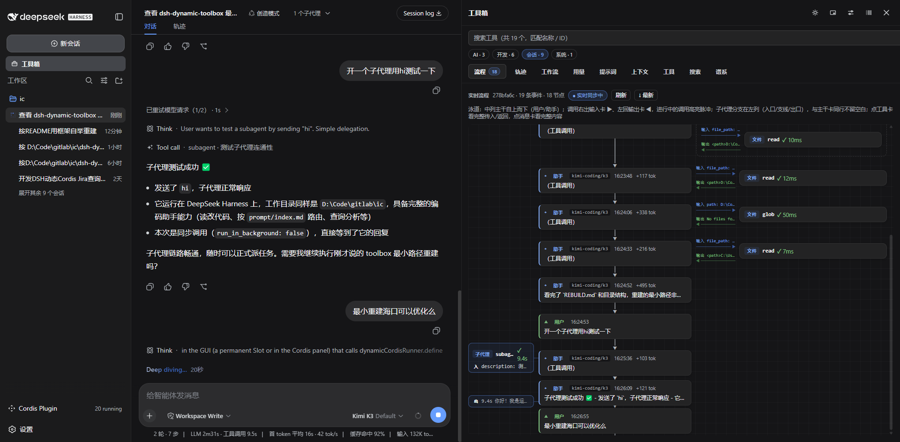

# Flowglass（流镜 · dsh-flowglass）

> A DeepSeek Harness plugin: turn the current session into a **live flowgraph** — three lanes, subagent branches, parallel groups, drill-down — plus a hot-reloadable session toolbox in the same drawer. MIT License.
>
> **v2026.08.20** — DSH rc.8 compatibility verified: zero-model-call autoboot, canonical multi-workspace isolation, streaming Flow cards with live timers/interruption settlement, session-following drawer fixes, and lifecycle-safe Client timers.
>
> 中文文档见下方 [中文文档](#中文文档)。



Every plugin is mounted through a **disk-loading stub**: the payload is a ~0.9KB stub, the implementation lives on disk, so code edits take effect by simply re-running the plugin — no re-define, no re-approval.

## Live flow

The drawer's default tab turns the **current session into a living flowgraph**, silently auto-refreshing every 2s (pausable via the live toggle):

- **Three-lane layout** — the center trunk walks user/assistant steps top-down; each tool call branches right with its input card ▶ and returns left with its output card ◀ (green on success, red on error, dashed while in flight)
- **Subagent branches** — a spawned child session grows its own left-column branch (entry / steps / exit) on the same row as the trunk card that started it, with steps sampled from the child's own session log
- **Drill-down** — click 「进入 →」on a subagent branch to open that child session's own flowgraph; breadcrumbs walk back level by level, nesting unlimited
- **Parallel groups** — simultaneous tool calls in one step are wrapped in a dashed 「并行 ×N」frame; the running call pulses with a highlight so you always see exactly which step the agent is on
- **Zero-jump details** — click a tool card for its full arguments/result, click a message card for full content with model + token metadata; details open in a side overlay instead of inflating the flow, so expand/collapse never moves your scroll position

## The toolbox

The same drawer hosts 21 hot-reloadable mini-tools on top of a shared framework (Host-side registry + RPC; Client-side drawer, tab bar and the `tb-` panel design system):

| Group | Tools |
| --- | --- |
| Project | jira (query/archive), git (history/diff), files (workspace tree) |
| Utilities | trace, http, ports, calc 5-in-1 (codec / regex / cron / text diff / generator), quota (API usage), flowedit (workflow docs) |
| Session insight | usage (token/context), prompt (system-prompt assembly), context (window), tools (schema list), search (full-text), lineage (tree) |
| AI | aiassist 7-in-1 (ask / translate / optimize / review / commit message / summary / compare) — routed through a shared `makeLlmHelper` |
| Self-inspection | selfview (screenshot / semantic snapshot / `ui_*` model tools) |
| Themes | theme-teal / theme-amber (mutually exclusive, opt-in) |

- **Bootstrap rebuild** — the framework auto-defines and starts all missing plugins from `plugins.json` on startup (idempotent, ~0.3s for all 22), honoring per-plugin enable memory
- **Zero-model-call autoboot** (optional): `host-bootstrap/` auto-starts the framework on session open — 0 model calls, 1 approval click, any mode
- **Contract smoke tests**: `node smoke.mjs` runs 21 simulation suites, including real rc.8 Cordis composition and multi-workspace isolation coverage

## Install

Prerequisites: DeepSeek Harness running with dynamic-plugin (Cordis) support; a workspace directory (repo root = workspace root, or the repo cloned as a subdirectory of it).

**Path A · compiled bundle from npm (recommended)**

```powershell
dsh plugin --profile web add dsh-flowglass        # Flow-only (framework is implicit)
dsh plugin --profile web add dsh-dynamic-toolbox   # the full toolbox
# upgrade: dsh plugin --profile web add dsh-flowglass@<new-version> && restart DSH
```

Compiled bundles are native static Host/Client packages: no dynamic approval, no `dyn/*`, Services/RPC/Slots/DOM/storage/events namespaced by bundleId. They don't hot-reload from disk — upgrade = add the new version + restart DSH.

**Path B · autoboot from source (your own machine, install once)**

```text
1. pwsh host-bootstrap/install.ps1     # idempotent; uninstall with -Uninstall
2. Restart DSH
3. Open any session in any mode → approve the Client card once
   → the framework auto-bootstraps all 22 plugins (selfview asks for one more approval)
```

**Path C · zero-install (AI-driven, nothing persisted in DSH)**

```text
1. Switch the session to 「创造模式」(Creative mode — the only preset mounting cordis_define/cordis_run)
2. In the session: cordis_define ← plugins/toolbox/payload.json
3. cordis_run and approve once → the framework auto-bootstraps the rest
```

Either way: daily rebuild/rerun/toggle afterwards works in **any mode** — the drawer manage view and the Cordis panel drive the process-global runner directly. Credentials (e.g. Jira) live in the Harness credential store or environment variables — never in this repo. Full guide: [`REBUILD.md`](REBUILD.md), plugin authoring: [`PLUGIN-DEV.md`](PLUGIN-DEV.md).

## Build bundles locally

The same `plugins/` sources can be compiled into installable npm packages:

```powershell
node scripts/build-toolbox-bundle.mjs --flow              # Flow-only (framework is implicit)
node scripts/build-toolbox-bundle.mjs --flow --jira       # Flow + Jira
node scripts/build-toolbox-bundle.mjs --features flow,jira --version 0.1.0
cd dist/toolbox-bundles/flow-jira && npm pack             # → installable tgz
dsh plugin --profile web add <tgz>                        # install/upgrade; remove to uninstall
```

- `--name` sets the npm package name (publishable with `npm publish`); `--version` must be a valid semver
- Gates: `node scripts/verify-generated.mjs` (dynamic-dev drift), `node scripts/verify-bundle.mjs <dir> [--pack]` (native static contract + tarball list), `node smoke.mjs` (21 suites)
- `selfview` still depends on the dynamic-only harness bridge and is rejected by the static compiler until its native Remote migration is implemented

## Why dynamic (framework advantages)

- **Workspace-isolated, process-multiplexed** — one process can host multiple repository toolboxes at once; registry, management actions and enable memory stay routed to the owning workspace
- **Hot reload** — the implementation lives on disk behind a ~0.9KB stub: re-run to apply edits, no re-define, no re-approval, no process restart
- **Approval gate kept** — browser code still asks once per process; nothing becomes unconditionally trusted at install time
- **Immutable versions** — packages coexist; update flips a pointer, rollback is one call, a failed update never loses the working version
- **Self-bootstrap rebuild** — dynamic plugins don't survive restarts, so the framework re-defines everything missing from `plugins.json` in ~0.3s; the optional `host-bootstrap/` trigger reduces that to "open a session, one click"
- **AI-native** — `cordis_define` / `cordis_run` are model tools: an agent can build and mount a tool for itself at runtime

## Develop your own tool

Coupling is deliberately narrow: a tool plugin only needs `ctx.get('toolboxRegistry').register(desc, handler)` plus the HTML panel protocol — three steps, a ~15-line skeleton, no client code for Host-only tools. Full guide: [`PLUGIN-DEV.md`](PLUGIN-DEV.md).

## License

[MIT](LICENSE) © 2026 Iwctwbh

---

# 中文文档

# Flowglass（流镜 · dsh-flowglass）

> DeepSeek Harness 插件：把当前会话实时画成**流程图**——三列泳道、子代理分支、并行分组、逐层钻取；同一个抽屉里还挂着一组可热重载的会话小工具。MIT License。
>
> **v2026.08.20** — 已验证兼容 DSH rc.8：零模型调用自举、canonical 多工作区隔离、Flow 流式助手卡/实时计时/中断收口、抽屉会话跟随修复，以及 Client Timer 生命周期化。


## 实时流镜

抽屉默认 Tab，把**当前会话实时画成流程图**，每 2s 静默自刷（live 开关可暂停）：

- **三列泳道**：中列主干自上而下走「用户/助手」步骤；工具调用右出输入卡 ▶、左回输出卡 ◀（成功绿色、错误红色、进行中虚线）
- **子代理分支**：子会话在左列长出独立支线（入口/支线/出口），与触发它的主干卡同行不留空白，支线步骤取自子会话自己的日志
- **钻取**：点分支上的「进入 →」打开该子会话自己的流程图，「← 返回」逐级退回，嵌套不限层数
- **并行分组**：同一步的多个并行调用用虚线框 +「并行 ×N」角标圈成一组；进行中的调用高亮脉冲，一眼看到智能体正跑到哪一步
- **零跳跃详情**：点工具卡看完整传入/返回，点消息卡看完整内容（含模型/tokens 元信息）；详情挂右侧浮层、不撑高流程内容，展开收起滚动位置不动

## 工具箱

流镜之外，同一个抽屉承载 21 个热重载小工具（由框架插件统一承载：Host 注册表 + RPC、Client 抽屉/Tab/通用 HTML 面板壳 + `tb-` 设计系统）：

| 分组 | 工具 |
| --- | --- |
| 项目工具 | jira（查询/归档）、git（历史/diff）、files（工作区文件树） |
| 实用工具 | trace、http、ports、calc 5 合 1（编解码/正则/Cron/文本对比/生成器）、quota（API 配额）、flowedit（工作流文档） |
| 会话洞察 | usage（token/上下文）、prompt（系统提示词拼装）、context（上下文窗口）、tools（schema 清单）、search（全文搜索）、lineage（谱系树） |
| AI 工具 | aiassist 7 合 1（问答/翻译/优化/评审/提交信息/摘要/对比）——共用 `makeLlmHelper` 路由 |
| 界面自查 | selfview（截屏/语义快照/`ui_*` 模型工具） |
| 主题 | theme-teal / theme-amber（互斥，按需激活） |

- **自举重建**：框架启动自动补齐 plugins.json 中缺失的全部插件（幂等，22 个约 0.3s），遵循逐插件启停记忆
- **零模型调用自举**（可选）：`host-bootstrap/` 开会话即自动启动框架——0 次模型调用、1 次批准点击、任何模式
- **契约冒烟**：`node smoke.mjs` 运行 21 套模拟，含真实 rc.8 Cordis 组合与多工作区隔离覆盖

## 安装

前置：已安装并运行 DeepSeek Harness（支持动态 Cordis 插件）；仓库根作为工作区打开（或 clone 为工作区的一级子目录）。

**方式 A · npm 安装编译包（推荐）**

```powershell
dsh plugin --profile web add dsh-flowglass       # 仅流镜（框架自动隐式加入）
dsh plugin --profile web add dsh-dynamic-toolbox  # 完整工具箱
# 升级：dsh plugin --profile web add dsh-flowglass@<新版本> 然后重启 DSH
```

编译包是原生静态 Host/Client 包：无动态批准、无 `dyn/*`，Service/RPC/Slot/DOM/storage/事件按 bundleId 隔离；不热重载——升级 = add 新版本 + 重启 DSH。

**方式 B · 源码自举（自己的机器，装一次）**

```text
1. pwsh host-bootstrap/install.ps1     # 幂等；卸载加 -Uninstall
2. 重启 DSH
3. 任何模式开新会话 → 批准卡点一次允许（不归属任何会话；同仓库并发会话 single-flight 只弹一份）
   → 框架自动补齐全部 22 个插件（selfview 会再弹一张批准卡）
   （注册表按仓库分键：同一仓库已有框架实例时新会话跳过自举，直接共享；不同仓库各自自举并行共存）
4. 多工作区并存：同一 DSH 进程内多个工作区可并行（抽屉跟随当前工作区切换，v6.3 multiplex）；
   需要进程级隔离时再走「每项目一个独立 DSH 实例」——均见 `REBUILD.md` → **多工作区并存**小节。
```

**方式 C · 零安装（AI 驱动，DSH 里不留任何东西）**

```text
1. 会话切到「创造模式」（唯一挂载 cordis_define/cordis_run 的 preset）
2. 会话中：cordis_define  ←  plugins/toolbox/payload.json
3. cordis_run，批准一次 → 框架自动补齐其余插件
```

两条路互不冲突、随时互切：bootstrapper 幂等跳过已定义，框架 doRebuild 幂等补齐缺失。跑起来之后，日常补齐/重跑/启停在**任何模式**都能进行——抽屉管理视图与 Cordis 面板直驱进程级全局 runner，不经过模型工具。凭据（Jira 等）走 Harness 凭据存储或环境变量，**不写入本仓库任何文件**。完整细节见 [`REBUILD.md`](REBUILD.md)，插件开发见 [`PLUGIN-DEV.md`](PLUGIN-DEV.md)。

## 本地构建发布包

同一份 `plugins/` 源码可编译成可安装的 npm 包：

```powershell
# 查看所有可选功能和参数
node scripts/build-toolbox-bundle.mjs --help

# Flow-only → dist/toolbox-bundles/flow/
node scripts/build-toolbox-bundle.mjs --flow --version 0.1.0 --clean

# Flow + Jira → dist/toolbox-bundles/flow-jira/
node scripts/build-toolbox-bundle.mjs --flow --jira --version 0.1.0 --clean

# 等价的通用写法；发布 scoped 包时可指定 --name
node scripts/build-toolbox-bundle.mjs `
  --features flow,jira `
  --id flow-jira `
  --name @your-scope/dsh-flow-jira-toolbox `
  --label "Flow + Jira 工具箱" `
  --version 0.1.0 `
  --clean
```

`--name` 决定 npm 包名（`npm publish` 直接发布）；`--version` 必须是合法 semver。验证与打包：

```powershell
node scripts/verify-bundle.mjs dist/toolbox-bundles/flow --pack
Push-Location dist/toolbox-bundles/flow
npm pack
Pop-Location
```

`npm pack` 会在对应目录生成类似 `dsh-flow-toolbox-0.1.0.tgz` 的文件。升级：提高 `--version`，重新构建、验证、`npm pack`，再对新 tgz 执行同一个 `dsh plugin ... add` 命令并重启 DSH。卸载：

```powershell
dsh plugin --profile web remove dsh-flow-toolbox
dsh plugin --profile web remove dsh-flow-jira-toolbox
```

编译合集自包含（不读本仓库 `loader.js` / `plugins.json` / `payload.json`），Service、Remote、Slot、DOM、storage、事件和 CSS 全部按 bundleId 隔离，可与动态模式及其他合集同进程共存。工具业务数据仍落工作区 `.dsh-dynamic-toolbox/`；静态合集没有动态管理/热重载，升级必须重新构建、安装并重启。`selfview` 仍依赖动态专用 harness bridge，迁移为原生 Remote 前静态编译器会明确拒绝它。

- 动态开发模式仍遵循 `<工作区>/.dsh-dynamic-toolbox/toolbox-plugins.json` 启停记忆；原生静态合集的功能集合由构建命令固定
- 静态合集显式选择主题即随原生 Client 加载；动态模式主题仍按原有方式 define 后按需启动

## 框架优势（为什么全动态）

- **工作区隔离、进程内复用**：同一进程可并行承载多个仓库工具箱；注册表、管理操作和启停记忆均按所属工作区路由
- **桩热重载**：实现全在磁盘、payload 仅 ~0.9KB 桩；点「重跑」即生效，不重启进程、不重新批准
- **批准闸门保留**：浏览器代码每进程仍过一次手，不存在"安装即永久信任"
- **不可变多版本**：Package 并存，update 切指针、失败不丢旧版、回滚一条命令
- **自举重建**：动态插件不跨进程——框架启动自动补齐缺失（~0.3s）；配 host-bootstrap 则开会话即重建
- **AI 原生**：`cordis_define` / `cordis_run` 是模型工具，智能体能在运行时自己造工具装上用

## 扩展：开发自己的工具插件

耦合面只有两条——`ctx.get(TOOLBOX_RUNTIME.registryService).register(desc, handler)`（经 shared/host.js 的 tryRegisterTool）和 HTML 面板协议。新插件三步：建 `plugins/<key>/tool.js` → `build/plugin-catalog.mjs` 的 PLUGINS 表加一行 → `node make-payloads.mjs` 后 define+run；骨架约 15 行，Host-only 不用写 Client 代码。完整指南（面板契约/踩坑/主题/冒烟）：[`PLUGIN-DEV.md`](PLUGIN-DEV.md)。

## 数据与隐私约定

以下内容**不入库**（见 `.gitignore`）：

| 路径 | 内容 |
| --- | --- |
| `.dsh-dynamic-toolbox/` | 运行状态与历史：Jira 查询记录、AI 台账、启停记忆、自举偏好、自动补齐报告 |
| `.dsh-dynamic-toolbox/data/` | 内容产物：Jira 工单归档（issue.md/json + 附件） |
| `.scratch/` | 开发草稿/一次性脚本 |

## 文档索引

- [`REBUILD.md`](REBUILD.md) — 目录结构、重建（含零模型调用自举）、迭代、数据与凭据
- [`PLUGIN-DEV.md`](PLUGIN-DEV.md) — 新插件三步、impl 骨架、面板契约
- [`插件.md`](插件.md) — 心智模型与真实坑清单

## License

[MIT](LICENSE) © 2026 Iwctwbh
